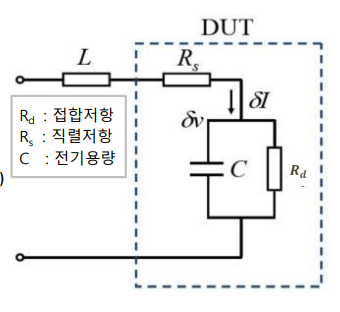
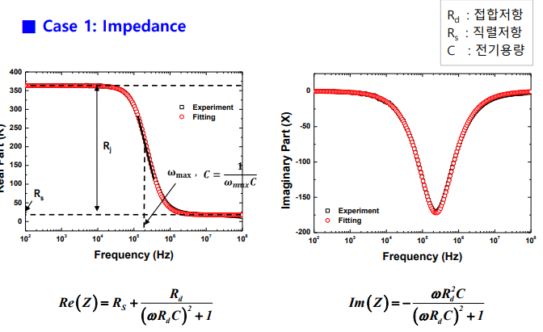

<h1 align="center">
    <br>
    Fitting 파일
    <br>
  </h1>

<br>
<br>

  ## 목표
  <br>
  <p align="center">
      <a>
          
      </a>
      <br>
      <br>
      <a>발광 다이아오드의 발광 재결합 운반자 수명과 비발과 재결합 운반자 수명을 구하기 위해 등가모델을 설정하여 유추하고자 함.</a>
      <br>
      <a>LED의 전기적인 등가회로는 실수부와 허수부로 나타낼 수 있고 다음 그림과 같이 fitting 하고자 함.</a>
      <br>
      <br>
      <a>
          
      </a>
      <br>
      <br>
      <a>Fitting을 위해 맞춰야할 파라미터는, 직렬 저항, 병렬 저항, 커패시터스, 인덕턴스가 있고, 이를 비선형 최적화를 통해 맞추고자 함.</a>
  </p>
  
  
  ## 실행

  requirements.txt로 필요한 패키지 설치 후, main.py로 file안에 있는 실험값들을 이론값에 fitting하기 위해 파라미터를 유추함.
  <br>
  levenberg-marquardt 알고리즘을 이용하여 구하였음.

  ```bash
  # 패키지 설치
  $ pip install -r requirements.txt
  
  # 파라미터 예측
  $ python main.py
  ```
  

<h1 align="center">
    <br>
    Fourier 파일
    <br>
  </h1>
  
  ## 목표
  <br>
  <p align="center">
      <br>
      <a>우쿨렐레, 기타, 드럼, 피아노, 플루트 총 다섯 가지의 소리를 구별하고 예측하는 모델을 만들고자 함.</a>
      <br>
      <a>랜덤포레스트 기법을 통해 실현함.</a>
      <br>
  </p>
  
  
  ## 실행

  requirements.txt로 필요한 패키지 설치 후, 소리 변환, 훈련, 예측 순으로 이루어짐.
  <br>
  소리 변환은 푸리에 변환을 사용함.
  <br>

  ```bash
  # 패키지 설치
  $ pip install -r requirements.txt
  
  # set_data.py를 통해 소리를 만들 수도 있지만, kaggle을 통해 dataset을 불러옴
  $ python set_data.py

  # transform.py를 통해 소리 파형을 푸리에 변환으로 시간에서 주파수 변환함. 이를 통해 특성을 잘 파악 가능.\
  $ python transform.py

  # plot.py로 푸리에 변환 전과 후 시각화
  $ python plot.py

  # train.py를 통해 모델을 훈련함
  $ python train.py

  # test.py를 통해 랜덤한 소리가 어떤 악기에서 나온 소리인지 분류
  $ python test.py

  # classify.py를 통해 혼동행렬을 생성하여 정확도를 측정함.
  $ python classify.py
  ```
